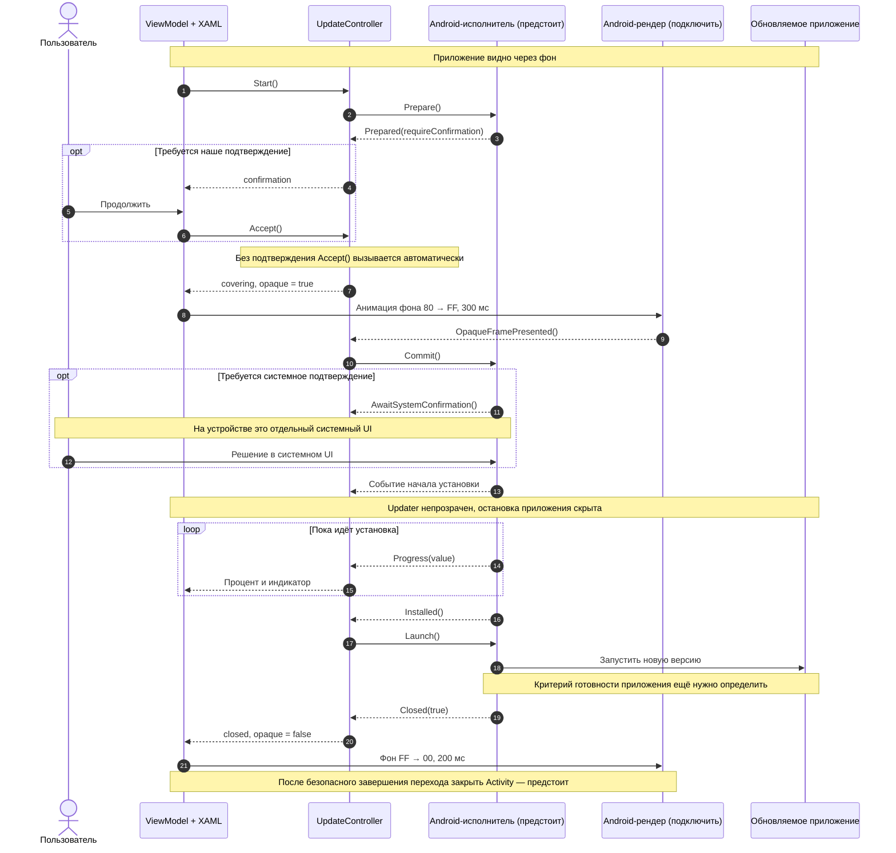
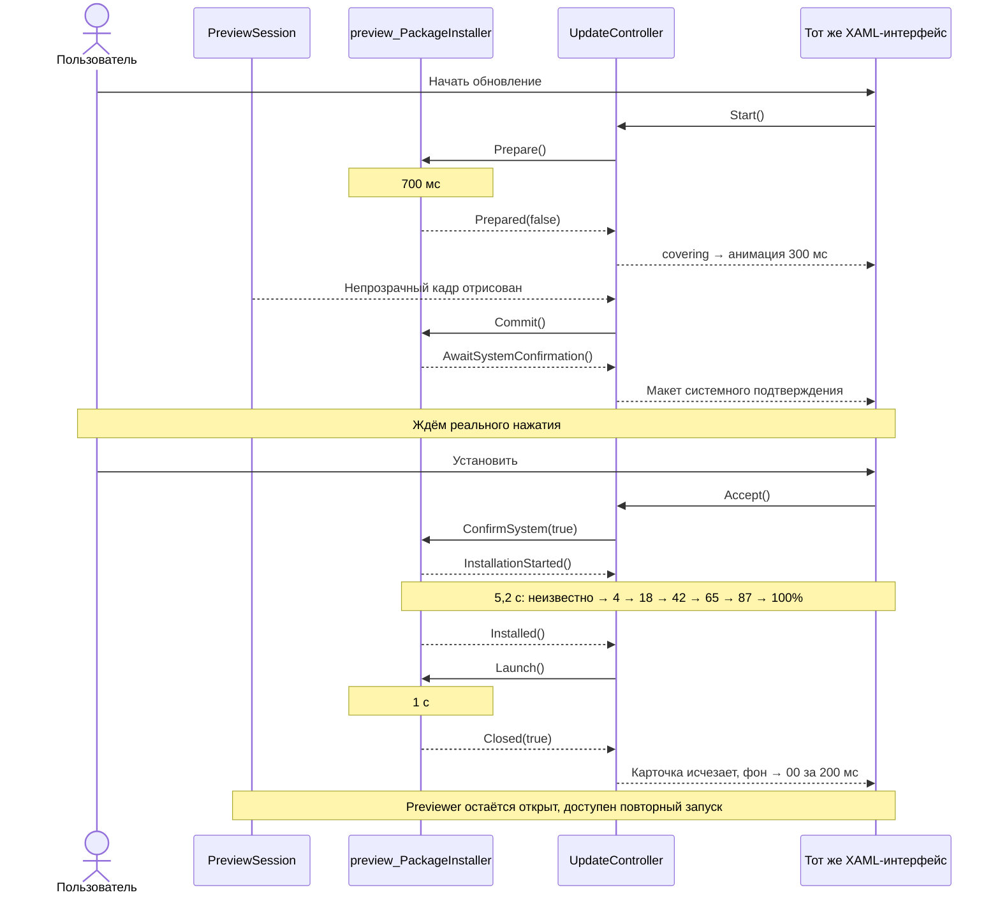

# Процесс обновления ApkUpdaterNew

Документ описывает текущие изменения и целевой сценарий на устройстве. Общий контроллер, XAML-интерфейс и preview-симулятор реализованы. Новый процесс ещё не подключён к реальной установке на Android.

## 1. Роли классов

| Участник | Ответственность |
|---|---|
| `UpdateController` | Текущий этап, подтверждение, отмена, прогресс, ошибка, разрешение на установку |
| `UpdateState` | Данные для UI: приложение, версии, этап, процент, непрозрачность и результат |
| `IPackageInstaller` | Контракт исполнителя: подготовить пакет, начать установку, обработать подтверждение, запустить приложение, отменить |
| `MainPageViewModel` | Преобразует состояние в тексты и видимость элементов, передаёт команды контроллеру |
| `MainPage.xaml` | Карточка обновления, кнопки, индикатор и анимации цвета фона |
| `preview_PackageInstaller` | Подменяет внешние операции событиями по таймеру |
| `PreviewSession` | Обновляет симулятор и рисует макет приложения позади updater |

Сейчас контроллер хранится в `AppSessionController` и доступен через `Updates()`. Это метод доступа, а не команда запуска. Обсуждённый перенос владения в `ApplicationSession` с отдельной зависимостью в `PageContext` пока не выполнен.

## 2. Целевой timeline на устройстве

Время проверки, ожидания пользователя, установки и запуска заранее неизвестно. Фиксированы только длительности анимаций интерфейса.



Это целевой сценарий, а не утверждение о готовой Android-интеграции. В текущем контроллере `InstallationStarted()` принимает событие только из `systemConfirmation`. Путь установки без системного подтверждения и порядок реальных Android-событий ещё требуют согласования.

### Шаг 1. Подготовка

Кнопка или будущая точка входа вызывает `Start()`. Повторный запуск во время активного процесса игнорируется. Без подключённого исполнителя процесс не начинается.

Фрагмент `UpdateController.cpp`:

```cpp
void UpdateController::Start() {
    if (!this->packageInstallerImpl || (this->updateState.phase != UpdatePhase::idle && this->updateState.phase != UpdatePhase::closed)) {
        return;
    }
    this->updateState.error.clear();
    this->updateState.progress = -1;
    this->updateState.opaque = false;
    this->updateState.installed = false;
    this->updateState.launched = false;
    this->SetPhase(UpdatePhase::preparing);
    this->packageInstallerImpl->Prepare();
}
```

Исполнитель должен сообщить результат подготовки. Получение APK, скачивание, OAuth и настоящая проверка подписи в новых изменениях не реализованы.

### Шаг 2. Подтверждение

```cpp
void UpdateController::Prepared(bool requireConfirmation) {
    if (this->updateState.phase != UpdatePhase::preparing) {
        return;
    }
    this->SetPhase(UpdatePhase::confirmation);
    if (!requireConfirmation) {
        this->Accept();
    }
}
```

При `requireConfirmation == true` процесс ждёт пользователя. Иначе сразу переходит к непрозрачному экрану.

### Шаг 3. Сначала закрыть фон, затем разрешить установку

Первая ветка `Accept()` задаёт `opaque = true` и этап `covering`. ViewModel выбирает XAML-состояние:

```cpp
const std::string desired = state.phase == core::UpdatePhase::closed ? "Closed" : state.opaque ? "Opaque" : "Transparent";
if (desired != this->backgroundState) {
    xaml::VisualStateManager::GoToState(*this->root, "UpdateBackground", desired, !this->backgroundState.empty());
    this->backgroundState = desired;
}
```

Фрагмент `MainPage.xaml`:

```xml
<VisualState name="Opaque">
    <Storyboard>
        <ColorAnimation targetName="mainPage" property="background"
                        from="Current" to="#FF1E1E1E"
                        duration="300" easing="CubicOut"/>
    </Storyboard>
</VisualState>
```

Меняется альфа цвета фона. Текст и кнопки не становятся полупрозрачными вместе с ним.

Контроллер не отсчитывает 300 мс самостоятельно. Он ждёт уведомления рендера:

```cpp
void UpdateController::OpaqueFramePresented() {
    if (this->updateState.phase != UpdatePhase::covering || !this->packageInstallerImpl) {
        return;
    }
    this->SetPhase(UpdatePhase::installing);
    this->packageInstallerImpl->Commit();
}
```

На Android ещё нужно подключить это уведомление в подходящей точке вывода кадра. Завершение команды рисования и фактический показ кадра пользователю — разные события.

В текущей последовательности системное подтверждение идёт уже после затемнения. Наше предварительное подтверждение показывается на полупрозрачном фоне. Это различие нужно учитывать при окончательном проектировании UX.

### Шаг 4. Установка и результат

`Progress(value)` принимает значения от `-1` до `100`. Значение `-1` обозначает неизвестный процент. UI показывает точное число и десять сегментов, обновляемых одним циклом.

Достижение 100% не вызывает запуск приложения. Для этого нужно отдельное событие:

```cpp
void UpdateController::Installed() {
    if (this->updateState.phase != UpdatePhase::installing) {
        return;
    }
    this->updateState.installed = true;
    this->SetPhase(UpdatePhase::launching);
    if (this->packageInstallerImpl) {
        this->packageInstallerImpl->Launch();
    }
}
```

До подтверждённого запуска фон остаётся непрозрачным. `Closed(true)` отмечает успех и переключает UI в завершающее состояние. Сам метод не закрывает Android Activity.

### Ошибки и отмена

| Ситуация | Текущее поведение |
|---|---|
| Ошибка подготовки | Сообщение на полупрозрачном фоне, кнопка «Закрыть» |
| Отмена до установки | Отмена работы исполнителя, переход в `closed` |
| Отказ в макете системного подтверждения | Исполнитель получает `ConfirmSystem(false)`, процесс закрывается |
| Установка уже началась | Кнопка отмены скрыта |
| Ошибка установки | Сообщение на непрозрачном фоне |
| Ошибка запуска | Установка считается успешной, но запуск — нет; сообщение остаётся на непрозрачном фоне |
| Закрытие сообщения | Карточка скрывается, фон уходит в прозрачность |

Навигация на другие страницы блокируется, пока этап отличается от `idle` и `closed`.

## 3. Timeline симуляции в previewer

Previewer исполняет тот же контроллер и тот же XAML. Подменены внешние операции и приложение позади окна.

Ниже успешный сценарий при скорости 1×. Время округлено: переходы происходят на ближайшем обновлении кадра. Ожидание нажатия пользователя не имеет фиксированной длительности.



### Как работает время

`PreviewSession.Update()` сначала обновляет package installer, затем обычный сеанс приложения:

```cpp
bool PreviewSession::Update() {
    this->packageInstaller.Tick();
    return this->applicationSession.Update();
}
```

Backend использует прошедшее время, а не блокирующее ожидание:

```cpp
void preview_PackageInstaller::Tick() {
    const auto now = std::chrono::steady_clock::now();
    const auto elapsed = std::chrono::duration_cast<std::chrono::milliseconds>((now - this->previous) * this->rate);
    this->previous = now;
    this->Advance(elapsed);
}
```

Регулятор скорости previewer меняет и скорость анимаций, и `rate` симулятора. Метод `Advance(std::chrono::milliseconds)` также позволяет тестам продвигать процесс без реального ожидания.

### Как моделируется установка

Фрагмент ветки установки в `Advance()`:

```cpp
constexpr std::array progress{-1, 4, 18, 18, 42, 65, 65, 87, 100, 100};
const auto index = static_cast<size_t>(std::min(this->elapsed / 500, 9.0));
this->updateController.Progress(progress[index]);
if (this->elapsed >= 5200) {
    this->work = Work::none;
    this->updateController.Installed();
}
```

Повторы процентов имитируют паузы. Это искусственный набор значений для проверки UI, а не модель точности или длительности реальной установки.

### Что нарисовано за updater

`PreviewSession.Render()` сначала рисует макет DocumentTranslator, затем настоящее дерево интерфейса updater. На этапах установки и запуска подложка заменяется надписью «Рабочий стол». После успешного запуска возвращается макет приложения.

Так проверяется, что непрозрачный экран скрывает остановку и запуск. Никакой реальный процесс DocumentTranslator не запускается и не завершается.

После рисования выполняется проверка:

```cpp
this->applicationSession.Render(renderer);
if (this->CurrentPage() == "MainPage" && this->Root().Background().alpha >= 0.9999f && this->Root().Opacity() >= 1) {
    this->applicationSession.Controller().Updates().OpaqueFramePresented();
}
```

Это проверка цвета и opacity корня в preview-рендере. Она не подтверждает поведение Android WindowManager или готовность окна другого приложения.

### Выбор сценария

В `MainPage.xaml` указан файл сценариев:

```xml
<?xaml-preview-scenario path="UpdateScenarios.json"?>
```

Выбор передаёт объект, например:

```json
{ "scenario": "install-error" }
```

Backend сбрасывает процесс и подставляет тестовые данные: DocumentTranslator, установленная версия 1.12.0 и доступная 1.13.0. Для переустановки обе версии — 1.12.0. После выбора сценария пользователь нажимает «Начать обновление».

| Сценарий | Отличие |
|---|---|
| `success` | Наше предварительное подтверждение пропускается; макет системного подтверждения остаётся |
| `reinstall` | Одинаковые версии, дополнительное подтверждение переустановки |
| `cancel` | Показывает предварительное подтверждение; отмену нажимает пользователь |
| `invalid-apk` | Через 700 мс возвращает ошибку подписи |
| `install-error` | Через 2,5 с установки возвращает ошибку нехватки места |
| `launch-error` | Установка завершается, через 1 с запуска возвращается ошибка |

При горячей перезагрузке XAML процесс продолжает жить в контроллере. ViewModel сбрасывает кеш применённого визуального состояния и повторно применяет актуальное состояние к новому дереву.

## 4. Граница готовности

Уже реализованы переходы состояния, карточка UI, XAML-анимации, блокировка навигации, симуляция шести сценариев и тесты рендера/взаимодействия.

Для устройства ещё нужны:

1. Источник запроса обновления и данных APK.
2. Android-реализация `IPackageInstaller`, настоящая проверка и установка пакета.
3. Сопоставление системных событий с состояниями контроллера. `ConfirmSystem(bool)` сейчас обслуживает макет и не означает возможность программно нажать системное подтверждение.
4. Уведомление о готовом непрозрачном экране перед установкой.
5. Запуск целевого приложения и определение момента, когда его безопасно показать.
6. Завершение Activity updater после перехода; обработка жизненного цикла и восстановления процесса.
7. Обсуждённое отделение `UpdateController` от общего `AppSessionController`.

На Android пока остаётся прежний путь команд `Update` / `Send logs`. Подключение нового контроллера к реальной установке этими изменениями не выполнено.

## 5. Исходники

- [UpdateController](ApkUpdaterNew.Application/Core/UpdateController.cpp)
- [Контракт исполнителя](ApkUpdaterNew.Application/Interface/IPackageInstaller.h)
- [MainPageViewModel](ApkUpdaterNew.Application/UI/Page/MainPageViewModel.cpp)
- [MainPage.xaml](ApkUpdaterNew.Application/UI/Page/MainPage.xaml)
- [preview_PackageInstaller](ApkUpdaterNew.PreviewPlugin/Session/preview_PackageInstaller.cpp)
- [PreviewSession](ApkUpdaterNew.PreviewPlugin/Session/PreviewSession.cpp)
- [Сценарии](ApkUpdaterNew.Application/UI/Page/UpdateScenarios.json)
- [Тесты симуляции](Tests/UpdateSimulation.cpp)